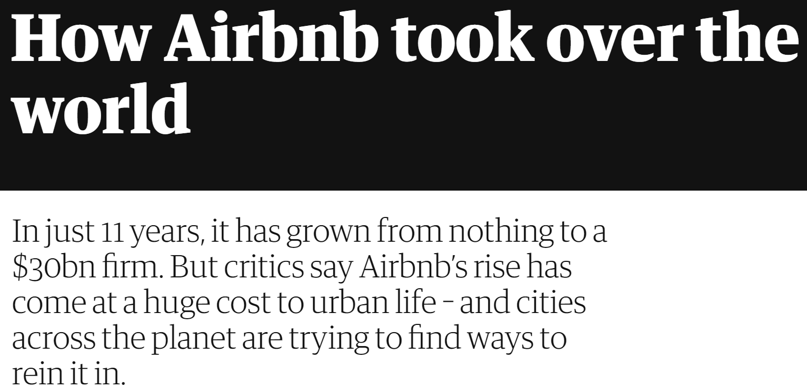
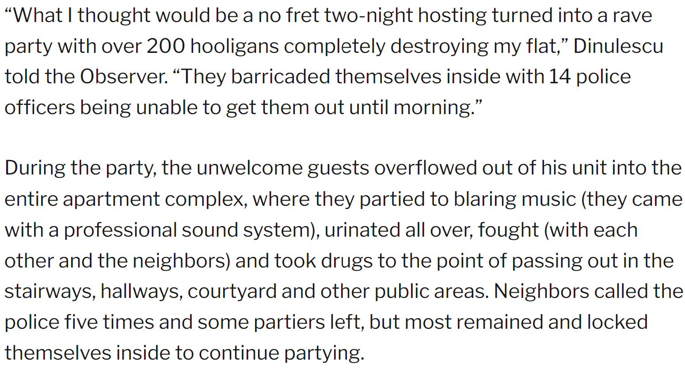
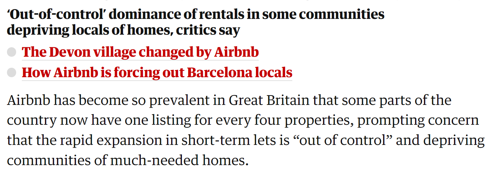
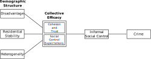

```{r setup, include=FALSE}
library(tidyverse)
library(flextable)
library(showtext)
library(ggforce)
library(lubridate)
library(sf)
library(patchwork)
library(ggspatial)
library(ggtext)
source("../../syntax/project_functions.R")
knitr::opts_chunk$set(echo = TRUE)
nuff_col <- c("Nuffield Teal"  = "#00a191",
  "Nuffield Black" = "#212221",
  "Pure White"     = "#ffffff",
  "Cobalt Blue"    = "#002f87",
  "Rose Red"       = "#e9004c",
  "Electric Blue"  = "#00acc8",
  "Peach Orange"   = "#ffc7be",
  "Pine Green"     = "#00665e",
  "Burgundy"       = "#692044",
  "Sky Blue"       = "#c0dfeb",
  "Celadon Green"  = "#dce0ca")
knitr::opts_chunk$set(dev = "ragg_png")
load("../../data/output/abnb_density_data.RData")
load("../../data/derived/shape/london_lsoa.RData")
load("../../data/derived/shape/london_water.RData")
```

# The Growth of Airbnb


.image-90[

]

.footnote[Source: [Sherwood (2019) *The Guardian*](https://www.theguardian.com/technology/2019/may/05/airbnb-homelessness-renting-housing-accommodation-social-policy-cities-travel-leisure)]

???

Everyone knows about Airbnb; how many people here have stayed at an Airbnb? Rented one out?

Airbnb and the rest of the short-term rental market has reached a scale where it is having impacts on cities.

---
# Housing Markets

Barron et al. (2020, p. 45):

> To summarize the state of the literature on home-sharing, research (including this paper) has found that **home-sharing (1) raises local rental rates** by causing a reallocation of the housing stock, (2) **raises house prices** through both the capitalization of rents and the increased ability to use excess capacity...

???

The most well-recognized effects are on housing markets as properties are reallocated away from long-term uses, driving prices up for both renters and buyers.


---
# Disorder

.image-90[

]
.footnote[Source: [Lazzaro (2017) *The Observer*](https://observer.com/2017/03/airbnb-nda-damage-in-london-after-drug-party/)]

---
# Destabilization

.image-90[

]

.footnote[Source: [Kommenda et al. (2020) *The Guardian*](https://www.theguardian.com/technology/2020/feb/20/revealed-the-areas-in-the-uk-with-one-airbnb-for-every-four-homes)]

---
class: inverse
background-image: linear-gradient(to right, rgba(0, 0, 0, .6), rgba(0, 0, 0, .6)), url("img/london_street.jpg")
background-size: cover

# Criminological Theory

## and Airbnb


---
# Routine Activity Theory


* Crime is the results of criminal .bam[opportunity]

* Anything that creates opportunities will increase crime

  * This occurs *rapidly*

---
# Airbnb and Routine Activity

* Guests as *likely offenders*

   * More prone to anti-social behaviour

--

* Guests as *suitable targets*

   * Often away from residence (e.g., assault, robbery)
   * Less aware of and averse to risky situations
   * Recognizable as high-value targets
--

* Guests as *incapable guardians*

   * Less attached to neighborhood
   * Unfamiliar with residents and local norms
   * Often away from residence (e.g., burglary)

--

.centernote[These are stronger for *entire properties* than *spare rooms*.]

---
# Social Disorganization





* Strong neighborhood institutions reduce crime by promoting .bam[social control]

* Destabilizing social structures increases crime by reducing social control

   * This usually occurs *slowly*

---
## Airbnb and Social Disorganization

Entire properties replace longer-term residents with *very* short-term ones

* Reduces attachment to neighbourhood
* Inhibits network formation
* Weakens institutions

--

Spare rooms *add* short-term residents:

* Less disruptive
* May promote stability with additional income

---
# Broken Windows

.image-75[

]

* Disorder signals criminal opportunity

* Social control impedes crime and disorder

* Fear of crime causes withdrawal and destabilization, reducing social control


???

Reciprocal relationships between social control and disorder and crime

Some forms of social disorder may escalate into crime; drinking can turn into fighting

Disorder may drive residents out of neighborhood

---
# Airbnb and Broken Windows

Airbnb income may enable property rehabilitation

* Remediation of seriously disorderly properties reduces crime

--

Airbnb activity increases property values

* Increases tax base, incentives for social control, and police attention

--

Airbnb activity may generate disorder

* Escalates into more serious crime (opportunity)
* Reduces attachment to neighborhood and induces move-outs (destabilization)

--

.centernote[*Will mainly focus on routine activity and social disorganization today*]

---
# Causal Model

We encode these theories into a causal model

.image-280[
```{tikz theory-dag, echo = FALSE, fig.ext = 'svg', cache = TRUE}
\usetikzlibrary{positioning}
\definecolor{black}{HTML}{000000}
\tikzset{
    > = stealth,
    every node/.append style = {
        draw = none
    },
    every path/.append style = {
        arrows = ->,
        draw = black,
        fill = none
    },
    hidden/.style = {
        draw = black,
        shape = circle,
        inner sep = 1pt
    }
}
\tikz{
    \node (a1) at (0,0) {$A_1$};
    \node[hidden] (u) at (1,-1) {$U$};
    \node (c1) at (0,2)  {$C_1$};
    \node (a2) at (2,0)  {$A_2$};
    \node (c2) at (2,2)  {$C_2$};
    \node[hidden] (o1) at (0,1)  {$O_1$};
    \node[hidden] (o2) at (2,1)  {$O_2$};
    \node[hidden] (s1) at (-1,1) {$S_1$};
    \node[hidden] (s2) at (1,1)  {$S_2$};
    \path (a1) edge (o1);
    \path (c1) edge (o2);
    \path (c1) edge (s2);
    \path (o1) edge (c1);
    \path (a2) edge (o2);
    \path (o2) edge (c2);
    \path (a1) edge (a2);
    \path (a1) edge (s2);
    \path (a1) edge (s2);
    \path (a1) edge [bend right=25] (c2);
    \path (s2) edge (o2);
    \path (s1) edge (o1);
    \path (c1) edge [bend right=25] (a2);
    \path (u) edge (a1);
    \path (u) edge (a2);
    \path (u) edge [bend left=45] (s1);
    \path (u) edge (s2);
    \path (u) edge (o1);
    \path (u) edge (o2);
    \path (u) edge [bend left=60] (c1);
    \path (u) edge [bend right=60] (c2);
  }
```
]

.pull-left[
* **A**irbnbs
* **C**rime
]
.pull-right[
* **O**pportunity
* **S**ocial control capacity
* **U**nobservables (time stable)
]


---
# Hypotheses

1. Airbnb properties are positively related to crime

2. Entire properties will be more strongly related to crime than rooms

3. Airbnb activity will be negatively related to collective efficacy

4. The association between Airbnb activity and crime is partly mediated by collective efficacy

---
class: inverse
background-image: linear-gradient(to right, rgba(0, 0, 0, .6), rgba(0, 0, 0, .6)), url("img/london.jpg")
background-size: cover

# The Setting

---
# Airbnb and London

* One of the most popular Airbnb markets

  * \> 100,000 listings in a year<sup>1</sup>
  * 20% of surveyed households hosted in past year<sup>2</sup>
  * \>=% 10% of dwellings are Airbnbs in some districts<sup>3</sup>

.footnote[
[1] Temperton 2020; [2] MHCLH 2019; [3] Kommenda et al., 2020
]

--

* Recent policies promote Airbnb usage

  * Deregulation Act 2015

      * Permits 90 days of main residence renting per year

  * 2016 "Rent a Room" tax allowance

      * Increased from £4,250 to £7,500 

???

Our project focuses on London, one of the most popular Airbnb markets in the world.

---
# Data

.pull-left[
* .bam[Airbnb properties] from *AirDNA* via CDRC

   * Nov 2014 - May 2018
   * Property-month observations
   * Property type
   * Geolocation
   

]
.pull-right[


]

---
count: false

# Data

.pull-left[
* .bam[Airbnb properties] from *AirDNA* via CDRC

   * Nov 2014 - May 2018
   * Property-month observations
   * Property type
   * Geolocation
   
]
.pull-right[


* .bam[Collective efficacy] from *MOPAC Public Attitudes Survey*

   * Apr 2015 - Dec 2018
   * Ordinal indicators for:
      * Cohesion and trust (4)
      * Control expectations (3)
   * LSOA and ward IDs

]

---
count: false

# Data

.pull-left[
* .bam[Airbnb properties] from *AirDNA* via CDRC

   * Nov 2014 - May 2018
   * Property-month observations
   * Property type
   * Geolocation
   

* Police-recorded .bam[crime] from *data.london.gov.uk* and *data.police.uk*
  * 6 crime types
  * Anonymized geolocation or LSOA ID
]
.pull-right[


* .bam[Collective efficacy] from *MOPAC Public Attitudes Survey*

   * Apr 2015 - Dec 2018
   * Ordinal indicators for:
      * Cohesion and trust (4)
      * Control expectations (3)
   * LSOA and ward IDs

]

---
count: false

# Data

.pull-left[
* .bam[Airbnb properties] from *AirDNA* via CDRC

   * Nov 2014 - May 2018
   * Property-month observations
   * Property type
   * Geolocation
   

* Police-recorded .bam[crime] from *data.london.gov.uk* and *data.police.uk*
  * 6 crime types
  * Anonymized geolocation or LSOA ID
]
.pull-right[


* .bam[Collective efficacy] from *MOPAC Public Attitudes Survey*

   * Apr 2015 - Dec 2018
   * Ordinal indicators for:
      * Cohesion and trust (4)
      * Control expectations (3)
   * LSOA and ward IDs

* Not shown today:

   * Property sale records
   * Airbnb usage estimates
   * PAS perceived crime
   * Premier League games
   * Policy instruments
]

---

```{r map, echo = FALSE, message = FALSE, cache = TRUE, dev = "ragg_png", fig.retina = 5, fig.align="center", out.width = "720px", fig.height = 3.6, fig.width = 5.6, dev.args = list(bg = 'transparent')}
abnb_density_data %>%
  mutate(abnb_density = ifelse(abnb_density == 0, NA, abnb_density)) %>%
  ggplot(aes(fill = abnb_density)) +
  geom_sf(aes(color = abnb_density), lwd = 0.05) + 
  geom_sf(data = london_water, color = NA, fill = "skyblue", inherit.aes = FALSE) +
  coord_sf(expand = TRUE) +
  theme_void() + 
  annotation_scale(location = "bl", text_family = "serif", text_cex = 1) +
  annotation_north_arrow(which_north = "grid",
                         location    = "tl",
                         style       = north_arrow_orienteering(text_family = "serif"),
                         height      = unit(1, "cm"),
                         width       = unit(1, "cm")) +
  scale_fill_viridis_c(option = "inferno") +
  scale_color_viridis_c(option = "inferno") +
  guides(color = "none") +
  labs(fill = "Monthly<br>average<br>properties<br>per KM^2",
       title = "Airbnb Density in London LSOAs") + 
  theme(legend.position = "right",
        legend.text = element_text(margin = margin(l = 0, unit = "pt")),
        text = element_text(family = "serif", size = 12),
        legend.title = element_markdown(lineheight = .3),
        plot.margin = margin(0, 0, 0, 0),
        panel.background = element_rect(fill = "transparent",colour = NA),
        plot.background = element_rect(fill = "transparent",colour = NA))
```

---


```{r pop-map, echo = FALSE, message = FALSE, cache = TRUE, dev = "ragg_png", fig.retina = 5, fig.align="center", out.width = "720px", fig.height = 3.6, fig.width = 5.6, dev.args = list(bg = 'transparent')}
pop_density_plot <- abnb_density_data %>%
  ggplot(aes(fill = popden)) +
  geom_sf(aes(color = popden), lwd = 0.05) + 
  geom_sf(data = london_water, color = NA, fill = "skyblue", inherit.aes = FALSE) +
  coord_sf(expand = TRUE) +
  theme_void() + 
  annotation_scale(location = "bl", text_family = "serif", text_cex = 1) +
  annotation_north_arrow(which_north = "grid",
                         location    = "tl",
                         style       = north_arrow_orienteering(text_family = "serif"),
                         height      = unit(1, "cm"),
                         width       = unit(1, "cm")) +
  scale_fill_viridis_c(option = "inferno") +
  scale_color_viridis_c(option = "inferno") +
  guides(color = "none") +
  labs(fill = "Population<br>per KM^2", title = "Population Density of London") + 
  theme(legend.position = "right",
        legend.text = element_text(margin = margin(l = 0, unit = "pt")),
        text = element_text(family = "serif", size = 12),
        legend.title = element_markdown(lineheight = .3),
        plot.margin = margin(0, 0, 0, 0),
        panel.background = element_rect(fill = "transparent",colour = NA),
        plot.background = element_rect(fill = "transparent",colour = NA))
pop_density_plot
```

---
class: inverse
background-image: linear-gradient(to right, rgba(0, 0, 0, .6), rgba(0, 0, 0, .6)), url("img/house_party.jpg")
background-size: cover

# Airbnb and Crime

---
# The Model Again

.image-280[
```{tikz theory-dag-2, echo = FALSE, fig.ext = 'svg', cache = TRUE}
\usetikzlibrary{positioning}
\definecolor{black}{HTML}{000000}
\tikzset{
    > = stealth,
    every node/.append style = {
        draw = none
    },
    every path/.append style = {
        arrows = ->,
        draw = black,
        fill = none
    },
    hidden/.style = {
        draw = black,
        shape = circle,
        inner sep = 1pt
    }
}
\tikz{
    \node (a1) at (0,0) {$A_1$};
    \node[hidden] (u) at (1,-1) {$U$};
    \node (c1) at (0,2)  {$C_1$};
    \node (a2) at (2,0)  {$A_2$};
    \node (c2) at (2,2)  {$C_2$};
    \node[hidden] (o1) at (0,1)  {$O_1$};
    \node[hidden] (o2) at (2,1)  {$O_2$};
    \node[hidden] (s1) at (-1,1) {$S_1$};
    \node[hidden] (s2) at (1,1)  {$S_2$};
    \path (a1) edge (o1);
    \path (c1) edge (o2);
    \path (c1) edge (s2);
    \path (o1) edge (c1);
    \path (a2) edge (o2);
    \path (o2) edge (c2);
    \path (a1) edge (a2);
    \path (a1) edge (s2);
    \path (a1) edge (s2);
    \path (s2) edge (o2);
    \path (s1) edge (o1);
    \path (a1) edge [bend right=25] (c2);
    \path (c1) edge [bend right=25] (a2);
    \path (u) edge (a1);
    \path (u) edge (a2);
    \path (u) edge [bend left=45] (s1);
    \path (u) edge (s2);
    \path (u) edge (o1);
    \path (u) edge (o2);
    \path (u) edge [bend left=60] (c1);
    \path (u) edge [bend right=60] (c2);
  }
```
]

.pull-left[
* **A**irbnbs
* **C**rime
]
.pull-right[
* **O**pportunity
* **S**ocial control capacity
* **U**nobservables (time stable)
]

--

.centernote[*If concerned only with A → C, this simplifies*]

---
# Simplified Model

.image-280[
```{tikz model-dag, echo = FALSE, fig.ext = 'svg', cache = TRUE}
\usetikzlibrary{positioning}
\definecolor{black}{HTML}{000000}
\tikzset{
    > = stealth,
    every node/.append style = {
        draw = none
    },
    every path/.append style = {
        arrows = ->,
        draw = black,
        fill = none
    },
    hidden/.style = {
        draw = black,
        shape = circle,
        inner sep = 1pt
    }
}
\tikz{
    \node (a1) at (0,0) {$A_1$};
    \node[hidden] (u) at (1,-1) {$U$};
    \node (c1) at (0,2)  {$C_1$};
    \node (a2) at (2,0)  {$A_2$};
    \node (c2) at (2,2)  {$C_2$};
    \path (a1) edge (c1);
    \path (c1) edge (c2);
    \path (a2) edge (c2);
    \path (a1) edge (a2);
    \path (a1) edge (c2);
    \path (c1) edge (a2);
    \path (u) edge (a1);
    \path (u) edge (a2);
    \path (u) edge [bend left=60] (c1);
    \path (u) edge [bend right=60] (c2);
  }
```
]

.pull-left[
* **A**irbnbs
* **C**rime
]
.pull-right[
* ~~**O**pportunity~~
* ~~**S**ocial control capacity~~
* **U**nobservables (time stable)
]


--

.centernote[*This is a type of cross-lagged panel model*]

---
# Units of Analysis

Given our model, how should we aggregate data?

--

&zwj;Space:

* Opportunity is local
* Don't care about collective efficacy

--

&zwj;Time:

* Want to avoid Airbnb and crime simultaneity
* Want to capture causal effect timing
   * Opportunity is fast
   * Social control is slow
* Short periods complicate estimation

--

&zwj;Unit: **LSOA-quarters**

---
# Method: ML-SEM

Maximum Likelihood Fixed Effects Cross-Lagged Structural Equation Model (ML-SEM)<sup>1</sup>

* Asymptotically equivalent to Arellano-Bond<sup>2</sup>

  * Addresses time-stable confounders
  * Autoregressive parameter

* Better finite sample performance

.footnote[
[1] Allison et al. (2017)
[2] Arellano & Bond (1991)
]


--

* Disadvantages:

  * Gaussian errors only
  * *Really hates skew*
  * Infeasible when T is large


---
# ML-SEM Specification


.pull-left60[
.image-100[
```{tikz sem-dag, echo = FALSE, fig.ext = 'svg', cache = TRUE, fig.width = 10}
\usetikzlibrary{positioning,arrows.meta}
\definecolor{black}{HTML}{000000}
\definecolor{rose}{HTML}{e9004c}
\definecolor{cobalt}{HTML}{002f87}
\definecolor{pine}{HTML}{00665e}
\definecolor{electric}{HTML}{00acc8}
\definecolor{burgundy}{HTML}{692044}
\tikzset{
    every node/.append style = {
        draw = none
    },
    hidden/.style = {
        draw = black,
        shape = circle,
        inner sep = 1pt
    }
}
\tikz{
  \node (a1) at (1,0) {$A_1$};
  \node (a2) at (2,0) {$A_2$};
  \node (a3) at (3,0) {$A_3$};
  \node (a4) at (4,0) {$A_4$};
  \node (c1) at (1,2) {$C_1$};
  \node (c2) at (2,2) {$C_2$};
  \node (c3) at (3,2) {$C_3$};
  \node (c4) at (4,2) {$C_4$};
  \node (e2) at (2,3) {$e_2$};
  \node (e3) at (3,3) {$e_3$};
  \node (e4) at (4,3) {$e_4$};
  \node[hidden] (u) at (0,0) {$U$};
    
    \path[stealth-stealth] (u) edge [bend left=30] (c1);
    \path[stealth-stealth] (u) edge [bend right=30] (a1);
    \path[stealth-stealth] (u) edge [bend right=30] (a2);
    \path[stealth-stealth] (u) edge [bend right=30] (a3);
    \path[stealth-stealth] (u) edge [bend right=30] (a4);
    \path[stealth-stealth] (c1) edge [bend right=20] (a1);
    \path[stealth-stealth] (c1) edge [bend right=20] (a2);
    \path[stealth-stealth] (c1) edge [bend right=20] (a3);
    \path[stealth-stealth] (c1) edge [bend right=20] (a4);
    \path[stealth-stealth] (a1) edge [bend right=30] (a2);
    \path[stealth-stealth] (a1) edge [bend right=30] (a3);
    \path[stealth-stealth] (a1) edge [bend right=30] (a4);
    \path[stealth-stealth] (a2) edge [bend right=30] (a3);
    \path[stealth-stealth] (a2) edge [bend right=30] (a4);
    \path[stealth-stealth] (a3) edge [bend right=30] (a4);
    \path[stealth-stealth, cobalt] (e2) edge [bend left=20] (a3);
    \path[stealth-stealth, cobalt] (e2) edge [bend left=30] (a4);
    \path[stealth-stealth, cobalt] (e3) edge [bend left=20] (a4);

    \path[-stealth, burgundy] (c1) edge (c2);
    \path[-stealth, burgundy] (c2) edge (c3);
    \path[-stealth, burgundy] (c3) edge (c4);
    \path[-stealth, pine] (u) edge (c2);
    \path[-stealth, pine] (u) edge (c3);
    \path[-stealth, pine] (u) edge (c4);
    \path[-stealth] (e2) edge (c2);
    \path[-stealth] (e3) edge (c3);
    \path[-stealth] (e4) edge (c4);
    \path[-stealth, rose] (a1) edge [thick] (c2);
    \path[-stealth, electric] (a2) edge [thick] (c2);
    \path[-stealth, rose] (a2) edge [thick] (c3);
    \path[-stealth, electric] (a3) edge [thick] (c3);
    \path[-stealth, rose] (a3) edge [thick] (c4);
    \path[-stealth, electric] (a4) edge [thick] (c4);
  }
```
]
]

.pull-right30[

Outcome (Ct):
* LSOA-quarter crime counts

&zwj;Features:

* Airbnb effects:
  * .electric[Contemporaneous]
  * .rose[Lagged]
* .pine[Fixed effects]
* .burgundy[Autoregression]
* .cobalt[Predetermined regressors]
]

---

```{r quarter-results, echo = FALSE, message = FALSE, cache = FALSE, dev = "ragg_png", fig.retina = 5, fig.align="center", out.width = "600px", fig.height = 4.2, fig.width = 5, dev.args = list(bg = 'transparent')}
load("../../data/output/dpm_quarter_fit.RData")
dpm_coef_plot(dpm_quarter_fit, hide_lag = TRUE) + 
  theme(
        # text = element_text(family = "serif", size = 48),
        plot.margin = margin(0, 0, 0, 0),
        panel.background = element_rect(fill = "transparent",colour = NA),
        plot.background = element_rect(fill = "white",colour = NA))
```

---
# Property Types

Both theories suggest effects should be concentrated in *entire homes and apartments*

--

Respecify model with disaggregated measures:

* Entire Homes and Apartments

* Private Rooms

* Shared Rooms

---

```{r property-results, echo = FALSE, message = FALSE, cache = FALSE, dev = "ragg_png", fig.retina = 5, fig.align="center", out.width = "600px", fig.height = 4.2, fig.width = 5, dev.args = list(bg = 'transparent')}
load("../../data/output/dpm_quarter_diffprops_fit.RData")
dpm_coef_plot(dpm_quarter_diffprops_fit, hide_lag = TRUE, con_only = TRUE)  + 
  theme(
        # text = element_text(family = "serif", size = 48),
        plot.margin = margin(0, 0, 0, 0),
        panel.background = element_rect(fill = "transparent",colour = NA),
        plot.background = element_rect(fill = "white",colour = NA))
```

---
# Summary


Airbnb activity predicts instrumental crimes

* Consistent with routine activity
* Less consistent with social disorganization

--

Mainly contemporaneous effects

* Consistent with routine activity
* Inconsistent with social disorganization

--

Association is limited to entire homes and apartments

* Consistent with both theories


---
class: inverse
background-image: linear-gradient(to right, rgba(0, 0, 0, .5), rgba(0, 0, 0, .5)), url("img/onion_airbnb.jpg"), linear-gradient(to right, rgba(0, 0, 0, 1), rgba(0, 0, 0, 1))
background-size: 100%, 50%, 100%
background-position: center, center, center

# Airbnb and Collective Efficacy

---
# Yet Again

.image-280[
```{tikz theory-dag-3, echo = FALSE, fig.ext = 'svg', cache = TRUE}
\usetikzlibrary{positioning}
\definecolor{black}{HTML}{000000}
\tikzset{
    > = stealth,
    every node/.append style = {
        draw = none
    },
    every path/.append style = {
        arrows = ->,
        draw = black,
        fill = none
    },
    hidden/.style = {
        draw = black,
        shape = circle,
        inner sep = 1pt
    }
}
\tikz{
    \node (a1) at (0,0) {$A_1$};
    \node[hidden] (u) at (1,-1) {$U$};
    \node (c1) at (0,2)  {$C_1$};
    \node (a2) at (2,0)  {$A_2$};
    \node (c2) at (2,2)  {$C_2$};
    \node[hidden] (o1) at (0,1)  {$O_1$};
    \node[hidden] (o2) at (2,1)  {$O_2$};
    \node[hidden] (s1) at (-1,1) {$S_1$};
    \node[hidden] (s2) at (1,1)  {$S_2$};
    \path (a1) edge (o1);
    \path (c1) edge (o2);
    \path (c1) edge (s2);
    \path (o1) edge (c1);
    \path (a2) edge (o2);
    \path (o2) edge (c2);
    \path (a1) edge (a2);
    \path (a1) edge (s2);
    \path (a1) edge (s2);
    \path (s2) edge (o2);
    \path (s1) edge (o1);
    \path (a1) edge [bend right=25] (c2);
    \path (c1) edge [bend right=25] (a2);
    \path (u) edge (a1);
    \path (u) edge (a2);
    \path (u) edge [bend left=45] (s1);
    \path (u) edge (s2);
    \path (u) edge (o1);
    \path (u) edge (o2);
    \path (u) edge [bend left=60] (c1);
    \path (u) edge [bend right=60] (c2);
  }
```
]

.pull-left[
* **A**irbnbs
* **C**rime
]
.pull-right[
* **O**pportunity
* **S**ocial control capacity
* **U**nobservables (time stable)
]

--

.centernote[*This time we care about S*]

---
# Simplified Again

.image-280[
```{tikz ce-dag, echo = FALSE, fig.ext = 'svg', cache = TRUE}
\usetikzlibrary{positioning}
\definecolor{black}{HTML}{000000}
\tikzset{
    > = stealth,
    every node/.append style = {
        draw = none
    },
    every path/.append style = {
        arrows = ->,
        draw = black,
        fill = none
    },
    hidden/.style = {
        draw = black,
        shape = circle,
        inner sep = 1pt
    }
}
\tikz{
    \node (a1) at (0,0) {$A_1$};
    \node[hidden] (u) at (1,-1) {$U$};
    \node (c1) at (0,2)  {$C_1$};
    \node (a2) at (2,0)  {$A_2$};
    \node (c2) at (2,2)  {$C_2$};
    \node[hidden] (s1) at (-1,1) {$S_1$};
    \node[hidden] (s2) at (1,1)  {$S_2$};
    \path (a1) edge (c1);
    \path (c1) edge (c2);
    \path (c1) edge (s2);
    \path (a2) edge (c2);
    \path (a1) edge (a2);
    \path (a1) edge (s2);
    \path (a1) edge (s2);
    \path (s2) edge (c2);
    \path (s1) edge (c1);
    \path (a1) edge [bend right=25] (c2);
    \path (c1) edge [bend right=25] (a2);
    \path (u) edge (a1);
    \path (u) edge (a2);
    \path (u) edge [bend left=45] (s1);
    \path (u) edge (s2);
    \path (u) edge [bend left=60] (c1);
    \path (u) edge [bend right=60] (c2);
  }
```
]

.pull-left[
* **A**irbnbs
* **C**rime
]
.pull-right[
* ~~**O**pportunity~~
* **S**ocial control capacity
* **U**nobservables (time stable)
]

.centernote[*Now we need a collective efficacy measurement*]

---
# Measuring Collective Efficacy

Collective efficacy is a community-level .bam[latent variable]

* Survey respondents act as *informants*

--

Assume informant responses to collective efficacy indicators are a mix of:

* Latent variable we want to measure
* Non-systematic (random) measurement error
* Systematic perceptual error of individuals

--

Validity of measurement rests on .bam[reliability], a function of:

* Agreement between informants
* **Number of informants in each neighborhood**

--

.centernote[*We need to remove measurement error and estimate reliability*]


---
## Multilevel Measurement Model

.image-75[

]

---
count: false
## Stage 1

.image-75[

]

.centernote[*Purge measurement error, obtain individual estimate*]

---
count: false
## Stage 2

.image-75[

]

.centernote[*Adjust for composition, obtain neighborhood estimate*]

---
# Units of Analysis

Given our models, how should we aggregate data?

--

&zwj;Space:

* Some theoretical debate over social control spatial scale
* Many respondents needed for reliable measurement

--

&zwj;Time:

* Social control effects are slow
* Changes in social control capacity may be even slower
* Many respondents needed for reliable measurement

--

&zwj;Unit: **Ward-years**

* High CE reliability: 0.71
* Few zeroes but high skew in crime

---
# Specification

.footnote[[1] All covariances hidden for legibility]

.pull-left60[
.image-100[
```{tikz sem-dag-2, echo = FALSE, fig.ext = 'svg', cache = TRUE}
\usetikzlibrary{positioning,arrows.meta}
\definecolor{black}{HTML}{000000}
\definecolor{rose}{HTML}{e9004c}
\definecolor{cobalt}{HTML}{002f87}
\definecolor{pine}{HTML}{00665e}
\definecolor{electric}{HTML}{00acc8}
\definecolor{burgundy}{HTML}{692044}
\tikzset{
    every node/.append style = {
        draw = none
    },
    hidden/.style = {
        draw = black,
        shape = circle,
        inner sep = 1pt
    }
}
\tikz{
  \node (a1) at (1.25,0) {$A_1$};
  \node (a2) at (2.25,0) {$A_2$};
  \node (a3) at (3.25,0) {$A_3$};
  \node (a4) at (4.25,0) {$A_4$};
  \node (s1) at (0.75,0) {$S_1$};
  \node (s2) at (1.75,0) {$S_2$};
  \node (s3) at (2.75,0) {$S_3$};
  \node (s4) at (3.75,0) {$S_4$};
  \node (c1) at (1,2) {$C_1$};
  \node (c2) at (2,2) {$C_2$};
  \node (c3) at (3,2) {$C_3$};
  \node (c4) at (4,2) {$C_4$};
  \node[hidden] (u) at (0,1) {$U$};
  \path[-stealth, burgundy] (c1) edge (c2);
  \path[-stealth, burgundy] (c2) edge (c3);
  \path[-stealth, burgundy] (c3) edge (c4);
  \path[-stealth, pine] (u) edge (c2);
  \path[-stealth, pine] (u) edge (c3);
  \path[-stealth, pine] (u) edge (c4);
  \path[-stealth, rose] (a1) edge [thick] (c2);
  \path[-stealth, electric] (a2) edge [thick] (c2);
  \path[-stealth, rose] (a2) edge [thick] (c3);
  \path[-stealth, electric] (a3) edge [thick] (c3);
  \path[-stealth, rose] (a3) edge [thick] (c4);
  \path[-stealth, electric] (a4) edge [thick] (c4);
  \path[-stealth, rose] (s1) edge [thick] (c2);
  \path[-stealth, electric] (s2) edge [thick] (c2);
  \path[-stealth, rose] (s2) edge [thick] (c3);
  \path[-stealth, electric] (s3) edge [thick] (c3);
  \path[-stealth, rose] (s3) edge [thick] (c4);
  \path[-stealth, electric] (s4) edge [thick] (c4);
  }
```

Secondary models:

  * C 

]
]

.pull-right30[

Outcome (Ct):
* **Logged** Ward-year crime counts

Features:

* Airbnb and CE:
  * .electric[Contemporaneous]
  * .rose[Lagged]
* .pine[Fixed effects]
* .burgundy[Autoregression]
* Predetermined regressors<sup>1</sup>
]

---

```{r year-results, echo = FALSE, message = FALSE, cache = FALSE, dev = "ragg_png", fig.retina = 5, fig.align="center", out.width = "600px", fig.height = 4.2, fig.width = 5, dev.args = list(bg = 'transparent')}
load("../../data/output/dpm_year_ce_imputed_2lvl_fit.RData")
dpm_year_ce_imputed_2lvl_fit %>%
  mutate(term = str_replace(term, "std_ce_imputed_2lvl", "Collective\nEfficacy"),
         term = str_replace(term, "active_rentals", "Active\nRentals")) %>%
  dpm_coef_plot() +
  scale_x_continuous(breaks = c(-0.05, 0 , 0.05)) +
  theme(
        # text = element_text(family = "serif", size = 48),
        plot.margin = margin(0, 0, 0, 0),
        panel.background = element_rect(fill = "transparent",colour = NA),
        plot.background = element_rect(fill = "white",colour = NA))
```

---
# Airbnb and Collective Efficacy

How is Airbnb activity related to collective efficacy?

* Estimate both sides of Airbnb and CE cross-lagged model

--

```{r abnb-ce-results, echo = FALSE, message = FALSE, cache = FALSE, dev = "ragg_png", fig.retina = 5, fig.align="center", out.width = "600px", fig.height = 2.75, fig.width = 5, dev.args = list(bg = 'transparent')}
load("../../data/output/dpm_year_ce_abnb_fit.RData")
dv_ce <- dpm_year_ce_abnb_fit %>% 
  filter(dv == "Collective Efficacy" & !str_detect(term, "Collective Efficacy")) %>%
  mutate(term = str_replace(term, "Collective Efficacy", "Collective\nEfficacy"),
         term = str_replace(term, "Active Rentals", "Active\nRentals")) %>%
  ggplot(aes(x = estimate, y = spec)) + 
    ylab("*Specification*") + xlab(NULL) +
    geom_point() + 
    facet_grid( ~ term, switch = "y") + 
    geom_errorbarh(aes(xmin = conf.low, xmax = conf.high), size = 0.2, height = 0.2) +
    geom_vline(xintercept = 0, linetype = "dashed") + 
    theme_minimal() + 
    scale_x_continuous(breaks = c(-0.1, 0, 0.1)) +
    ggtitle("Outcome:\nCollective Efficacy") +
    theme(text = element_text(family = "serif"),
          panel.grid.major.y  = element_blank(),
          panel.grid.minor.x  = element_blank(),
          panel.spacing.y =unit(0,"lines"),
          strip.placement = "outside",
          strip.text.y = element_text(face = "bold"),
          axis.text.y = element_text(face = "italic"),
          axis.title.y = ggtext::element_markdown())

dv_abnb <- dpm_year_ce_abnb_fit %>% 
  filter(dv == "Active Rentals" & !str_detect(term, "Active Rentals")) %>%
  mutate(term = str_replace(term, "Collective Efficacy", "Collective\nEfficacy"),
         term = str_replace(term, "Active Rentals", "Active\nRentals")) %>%
  ggplot(aes(x = estimate, y = spec)) + 
    ylab(NULL) + xlab(NULL) +
    geom_point() + 
    facet_grid( ~ term, switch = "y") + 
    geom_errorbarh(aes(xmin = conf.low, xmax = conf.high), size = 0.2, height = 0.2) +
    geom_vline(xintercept = 0, linetype = "dashed") + 
    theme_minimal() +
    scale_x_continuous(breaks = c(0, 0.02)) +
    ggtitle("Outcome:\nLog of Active Airbnb Rentals") +
    theme(text = element_text(family = "serif"),
          panel.grid.major.y  = element_blank(),
          panel.grid.minor.x  = element_blank(),
          panel.spacing.y =unit(0,"lines"),
          strip.placement = "outside",
          strip.text.y = element_text(face = "bold"),
          axis.text.y = element_blank(),
          axis.title.y = ggtext::element_markdown())
dv_ce + dv_abnb
```

---
# Summary

Weak collective efficacy effects

   * Inconsistent with social disorganization

--

Weaker but persistent Airbnb effects

   * Inconsistent with social disorganization
   * More consistent with routine activity
      * Opportunity is contemporaneous and local

--

Airbnb activity may reduce collective efficacy over time


---
class: inverse
background-image: linear-gradient(to right, rgba(0, 0, 0, .6), rgba(0, 0, 0, .6)), url("img/oxford_houses.jpg")
background-size: cover

# Discussion

---
# Key Results

* Airbnb activity strongly associated with robbery, burglary, and theft
   
   * Some association with violence

--

* Effects appear operate in short-term

   * Suggests opportunity as mechanism

--

* Effects driven by entire homes and apartments for rent

--

* Little evidence for mediation by collective efficacy

  * Weak negative relationship with Airbnb
  * Airbnb effects not attenuated when including collective efficacy

---
# Limitations

* Omitted time-varying confounders

  * Results insensitive to English Premier League games

--

* Effect heterogeneity

  * Results insensitive to spatial clustering interaction

--

* Causal timing may be off

  * Results similar from monthly Poisson FE

--

* Collective efficacy less time stable than expected

   * Low indicator variation
      * "Very likely" is modal response in 8/9 indicators
   * May not be tapping social control capacity well

--

* Need a ML-SEM Poisson estimator

---
# Implications

Private short-term letting is reshaping the urban landscape

* Constraining rental markets
* Increasing home prices
* .bam[Compromising public safety]

--

Short-term letting is highly commercialized

* Dominated by dedicated properties
* Hosts with multiple properties

--

An externality problem

* Benefits accrue to few property owners
* Livability and affordability reduced for all

--

.centernote[*Policymakers should revisit short-term letting market incentives and regulation*]

---
class: inverse
# Thank You

---
count:false
class: inverse
# Appendix


---
count:false

```{r pas-descriptives, cache=TRUE, echo = FALSE, message = FALSE, label = "ce-descriptives", ft.htmlscroll =FALSE}
pas_descriptives %>%
  mutate(Measure = ifelse(battery != "Collective Efficacy", 
                          str_to_title(str_replace_all(Measure, "_", " ")), Measure)) %>%
  janitor::clean_names(case = "title") %>%
  filter(Battery == "Collective Efficacy") %>%
  select(-Battery) %>%
  flextable() %>%
  fontsize(size = 10, part = "all") %>%
  set_table_properties(width = 1, layout = "fixed") %>%
  width(j = 2:8, width = 0.6) %>%
  width(j = 1, width = 3) %>%
  padding(part = "all", padding.left = 1, padding.right = 1, padding.top = 2, 
          padding.bottom = 2) %>%
  colformat_double(digits = 2) %>%
  add_footer_lines("N = 48,093") %>%
  fontsize(size = 10) %>%
  border_remove() %>%
  bg(i = seq(2, 8, by = 2), bg = "grey90", j = 1:8) %>%
  padding(padding = 0.5, part = "all") %>%
  add_header_lines("MOPAC PAS: Collective Efficacy") %>%
  hline_bottom(border = officer::fp_border(width = 1), part = "body") %>%
  hline_bottom(border = officer::fp_border(width = 1), part = "header") %>%
  hline_top(border = officer::fp_border(width = 0.5)) 
```

---
count:false

```{r pas-cfa-descriptives, cache = TRUE, echo = FALSE, message = FALSE, label = "pas-cfa-descriptives", ft.htmlscroll =FALSE}
load("../../data/output/pas_cfa_descriptives.RData")
pas_cfa_descriptives %>%
  flextable() %>%
  add_header_lines("MOPAC PAS: Factor Loadings") %>%
  width(j = 1, width = 4) %>%
  border_remove() %>%
  padding(padding = 1, part = "all") %>%
  bg(i = seq(2, 8, by = 2), bg = "grey90", j = 1:2) %>%
  hline_bottom(border = officer::fp_border(width = 1), part = "body") %>%
  hline_bottom(border = officer::fp_border(width = 1), part = "header") %>%
  hline_top(border = officer::fp_border(width = 0.5))
```

---
count:false

```{r pas-descriptives, cache=TRUE, echo = FALSE, message = FALSE, label = "pas-descriptives", ft.htmlscroll =FALSE}
load("../../data/output/pas_descriptives.RData")
pas_descriptives %>%
  mutate(Measure = ifelse(battery != "Collective Efficacy", 
                          str_to_title(str_replace_all(Measure, "_", " ")), Measure)) %>%
  janitor::clean_names(case = "title") %>%
  filter(Battery != "Collective Efficacy") %>%
  as_grouped_data(groups = "Battery") %>%
  flextable() %>%
  set_header_labels(Battery = "") %>%
  fontsize(size = 10, part = "all") %>%
  set_table_properties(width = 1, layout = "fixed") %>%
  width(j = 3:9, width = 0.9) %>%
  width(j = 2, width = 1) %>%
  width(j = 1, width = 0.2) %>%
  merge_h_range(i = c(7,16), j1 = 1, j2 = 9) %>%
  padding(part = "all", padding.left = 1, padding.right = 1, padding.top = 2, 
          padding.bottom = 2) %>%
  colformat_double(digits = 2) %>%
  add_footer_lines("N = 48,093") %>%
  fontsize(size = 10) %>%
  bg(i = c(3, 5, 9, 11, 13, 15, 18, 20, 20), bg = "grey90", j = 1:9) %>%
  border_remove() %>%
  padding(padding = 0) %>%
  add_header_lines("MOPAC PAS: Sociodemographics") %>%
  hline_bottom(border = officer::fp_border(width = 1), part = "body") %>%
  hline_bottom(border = officer::fp_border(width = 1), part = "header") %>%
  hline_top(border = officer::fp_border(width = 0.5)) 
```

---
count:false
# References

.small[
Allison, P. D., Williams, R., & Moral-Benito, E. (2017). Maximum Likelihood for Cross-lagged Panel Models with Fixed Effects. Socius: Sociological Research for a Dynamic World, 3, 237802311771057. https://doi.org/10.1177/2378023117710578<br>
Arellano, M., & Bond, S. (1991). Some Tests of Specification for Panel Data: Monte Carlo Evidence and an Application to Employment Equations. The Review of Economic Studies, 58(2), 277. https://doi.org/10.2307/2297968<br>
Barron, K., Kung, E., & Proserpio, D. (2021). The Effect of Home-Sharing on House Prices and Rents: Evidence from Airbnb. Marketing Science, 40(1), 23–47. https://doi.org/10.1287/mksc.2020.1227<br>
Kommenda, N., Pidd, H., & Brooks, L. (2020). Revealed: The areas in the UK with one Airbnb for every four homes. The Guardian.<br>
Ministry of Housing, Communities & Local Government (MHCLG). (2019). English housing survey: Private rented sector, 2017-2018. Ministry of Housing, Communities & Local Government.<br>
Temperton, J. (2020). Airbnb has devoured London - and here’s the data that proves it. Wired UK.

Unsplash photos:

[Title slide photo by Andrea Davis](https://unsplash.com/photos/NngNVT74o6s)<br>
[House party photo by Jacob Bentzinger](https://unsplash.com/photos/_HXFz-0g9w8)<br>
[Oxford houses by Toa Heftiba](https://unsplash.com/photos/nrSzRUWqmoI)<br>
[London street by Tomek Baginski](https://unsplash.com/photos/SiGPM-HLYyk)<br>
[London aerial photo by Benjamin Davies](https://unsplash.com/photos/Oja2ty_9ZLM)

[Story from the Onion](https://www.theonion.com/whole-conversation-wasted-getting-to-know-new-neighbors-1849022517)


]